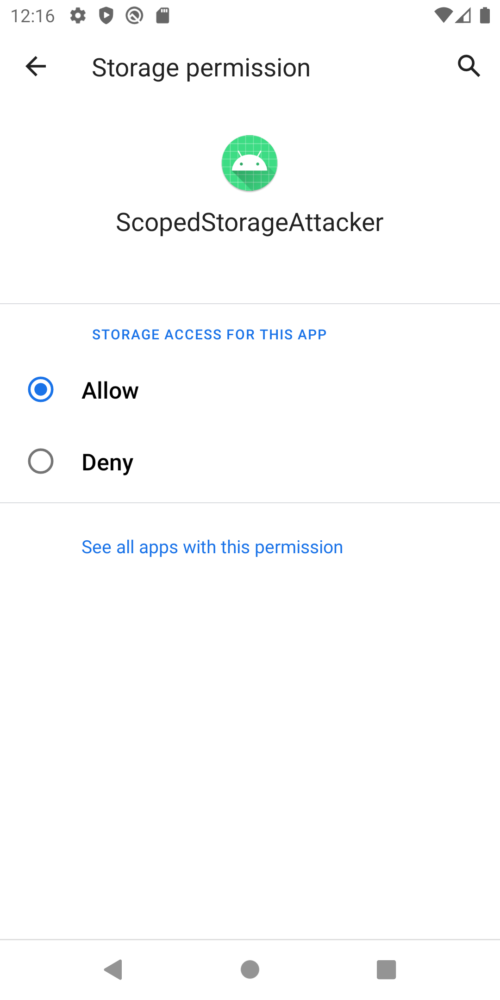

Android10より導入されたScopedStorageでは、外部ストレージ内に存在するアプリ固有のファイルへのアクセス権限が強化された。
セキュリティの観点で、他のアプリ用のScopedStorageの内容が参照可能かどうかを検証した。

結論
- Android10以下では、Attackerアプリに以下の権限を付与した場合、他のアプリのScopedStorageへの参照が許可される。
    - android.permission.READ_EXTERNAL_STORAGE
        - 
    - android:requestLegacyExternalStorage="true"
        - AndroidManifest.xmlで定義するだけで良い。
- 検証端末がAndroid11以降の場合、権限によらず、他のアプリのScopedStorageの内容は参照不可。

検証端末
- Android Studio Pixel3 エミュレータ

アプリ
- ScopedStorageSample
    - 本アプリのScoped Storage内にファイルを作成する
    - 本アプリのScoped Storage内のファイルを参照し、TextViewにファイル内容を出力する
    - 対象ファイル：
        - /sdcard/data/com.example.ScopedStorageSample/files/test.txt
- ScopedStorageAttacker
    - 別アプリのScoped Storage内のファイルを参照し、TextViewにファイル内容を出力する
    - 対象ファイル：
        - /sdcard/data/com.example.ScopedStorageSample/files/test.txt

- GooglePlayStoreのリリース制限
    - https://developer.android.com/google/play/requirements/target-sdk?hl=ja
    - PlayStoreにリリースする際は、ターゲットAPI Levelを34以上にする必要がある
    - ただし、PlayStoreにアップロードせずに組織内などのみで配布する場合には本制限の影響を受けない

